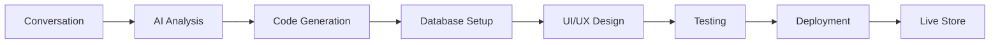

# Quick Start Guide

Learn how to create your first AI-powered e-commerce solution with Calvin Code in just a few minutes.

## Your First E-commerce Site

Calvin Code transforms ideas into fully functional e-commerce platforms through conversation. Here's how to get started:

### Step 1: Start a Conversation

Begin by describing your e-commerce vision:

!!! example "Example Conversation"
    
    **You:** "I want to create an online store for handmade jewelry. It should have a modern design, support for multiple payment methods, and inventory tracking."
    
    **Calvin Code:** "I'll create a beautiful jewelry e-commerce site for you! Let me set up a modern design with product galleries, shopping cart functionality, payment processing, and inventory management. What's your brand name and preferred color scheme?"

### Step 2: Refine Your Requirements

Calvin Code will ask clarifying questions to understand your needs:

- **Brand Identity**: Colors, fonts, logo placement
- **Product Catalog**: Categories, pricing structure, inventory needs  
- **Payment Methods**: Stripe, PayPal, credit cards
- **Shipping Options**: Local delivery, international shipping
- **Additional Features**: Reviews, wishlist, customer accounts

### Step 3: Watch It Build

Calvin Code generates your complete e-commerce platform:



### Step 4: Deploy and Launch

Your store is ready to go live:

- **Preview** the generated site
- **Test** all functionality 
- **Deploy** with one click
- **Start selling** immediately

## Common Use Cases

### Fashion & Apparel Store

```
"Create a fashion boutique website with size charts, color variants, 
and seasonal collections. Include customer reviews and a wishlist feature."
```

**Generated Features:**
- Product variant management (sizes, colors)
- Dynamic size charts
- Collection organization
- Customer review system
- Wishlist functionality
- Mobile-responsive design

### Digital Product Marketplace

```
"I need a platform to sell digital courses and ebooks. Include user 
accounts, secure download links, and progress tracking for courses."
```

**Generated Features:**
- Digital product delivery
- User authentication system
- Download protection
- Course progress tracking
- Payment processing
- Customer dashboard

### B2B Wholesale Platform

```
"Build a wholesale platform where retailers can place bulk orders 
with tiered pricing and credit terms."
```

**Generated Features:**
- Bulk order management
- Tiered pricing structure
- Credit application system
- Order approval workflow
- Inventory reservations
- B2B-specific checkout

## Advanced Features

### Data Integration

Connect your store to existing data sources:

```
"Connect this store to my BigQuery database to sync inventory 
levels and sales analytics in real-time."
```

Calvin Code will:
- Set up secure database connections
- Create real-time sync processes
- Build analytics dashboards
- Configure automated reporting

### Multi-Platform Deployment

Expand to mobile and other channels:

```
"Also create a mobile app version of this store with push 
notifications for order updates."
```

**Results:**
- Native mobile application
- Push notification system
- Synchronized data across platforms
- Unified admin dashboard

### Custom Integrations

Connect with your existing tools:

```
"Integrate this with our existing CRM system and accounting software 
for automatic order processing and customer management."
```

## Best Practices

### 1. Be Specific About Requirements

❌ **Too Vague:** "I want an online store"

✅ **Clear Requirements:** "I want an online store for organic skincare products with subscription options, ingredient transparency, and eco-friendly packaging information"

### 2. Mention Your Brand Identity

Include details about:
- Target audience
- Brand personality
- Visual preferences
- Competitive differentiation

### 3. Consider the Full Customer Journey

Think about:
- Product discovery
- Purchase process
- Order fulfillment
- Customer support
- Return/refund handling

### 4. Plan for Growth

Mention scalability needs:
- Expected traffic volume
- International expansion plans
- Additional product categories
- Integration requirements

## Example Conversations

### Subscription Box Service

```
User: "Create a monthly subscription box service for coffee lovers. 
Include different subscription tiers, pause/resume options, and 
personalization based on taste preferences."

Calvin Code Response: "Perfect! I'll create a subscription-based 
coffee service with multiple tiers, customer preference profiling, 
and flexible subscription management. Let me set up..."
```

**Generated Platform:**
- Subscription management system
- Customer preference questionnaire  
- Multiple subscription tiers
- Billing automation
- Shipment tracking
- Customer portal for account management

### Marketplace Platform

```
User: "Build a marketplace where local artisans can sell their 
handmade products. Include vendor onboarding, commission tracking, 
and dispute resolution."

Calvin Code Response: "I'll build a multi-vendor marketplace with 
vendor management tools, commission calculation, and built-in 
communication systems..."
```

**Generated Features:**
- Multi-vendor architecture
- Vendor onboarding workflow
- Commission tracking and payouts
- Product approval system
- Dispute resolution tools
- Analytics for vendors and admin

## Next Steps

Once your store is live:

1. **Monitor Performance**: Use built-in analytics
2. **Gather Feedback**: From customers and stakeholders  
3. **Iterate and Improve**: Request modifications through conversation
4. **Scale Operations**: Add new features as you grow

### Need Help?

- **Documentation**: Explore [Connectors](../connectors/) for integrations
- **Support**: [Schedule a demo](https://www.gopersonal.com/es/contact) for assistance
- **Community**: Join other Calvin Code users for tips and best practices

---

Ready to create something amazing? Start your conversation with Calvin Code and watch your e-commerce vision come to life!